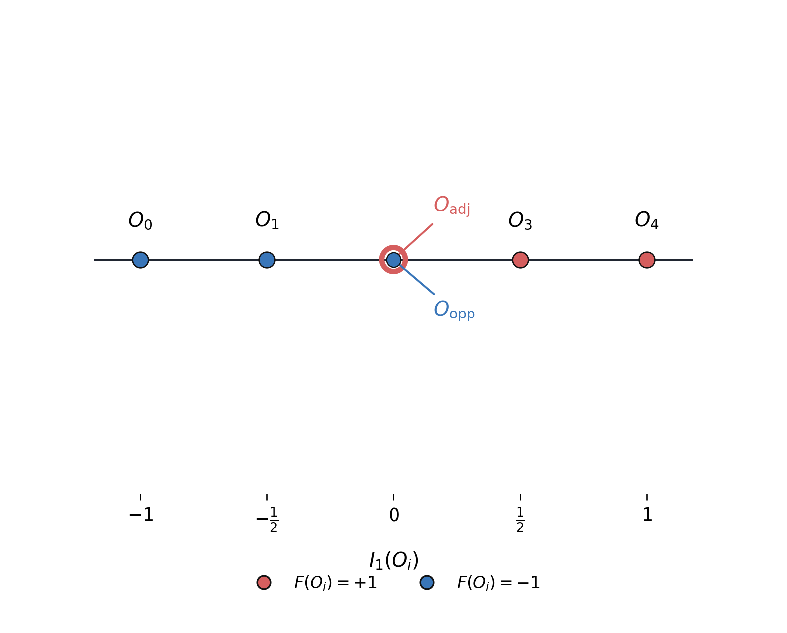
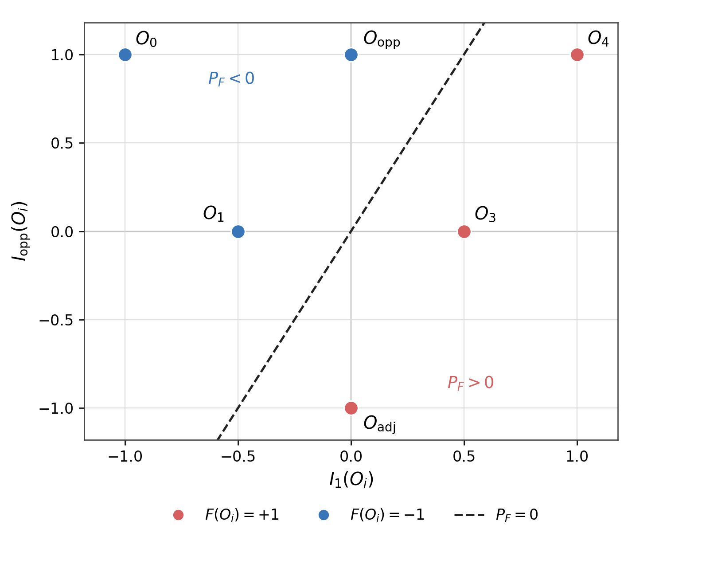

# Symmetries in Transformers Computing Boolean Functions

This project studies how the computational capacity of a simple transformer depends on its number of attention heads. It was completed as part of a research assessment by [Verified Mechanisms](https://verifiedmechanisms.ai/) based on an autoresearch repository containing roughly 200 theorems about the Boolean functions computed by a single attention layer.

The model receives an input sequence of Boolean variables together with a fixed query token. Only the residual stream at the query token is read by the classifier. For a Boolean function $f$, its **head complexity** $H^*(f)$ is the minimum number of attention heads required to compute it.

## What I did

- Reconstructed the central results of the repository in a self-contained [18-page write-up](https://github.com/ben-meiring/transformer-symmetries/blob/main/transformer_symmetries_writeup.pdf).
- Derived the scalar normal form of an attention head and showed that threshold degree gives the general lower bound $\deg_{\pm}(f) \leq H^*(f)$.
- Used this framework to recover the exact head complexity of parity: $H^*(\mathrm{PARITY}_n)=n$.
- Developed a symmetry-based method for analyzing whole classes of Boolean functions using group orbits and Reynolds-averaged Walsh characters.
- Reduced the search for the lowest-degree invariant separator to a linear-programming feasibility problem.
- Produced Lean-verified proofs of two symmetry-based lower bounds.
- Built an interactive **Theorem Atlas** to organize the repository's results, dependencies, open questions, and refuted hypotheses.

## A quick example: cyclic symmetry

Consider four sign-valued inputs $z_i\in\{-1,1\}$ arranged on a cycle, with cyclic rotations identified by $g(z_1,z_2,z_3,z_4)=(z_2,z_3,z_4,z_1)$.

The 16 possible inputs collapse into six rotation orbits: $O_0$, $O_1$, $O_{\mathrm{adj}}$, $O_{\mathrm{opp}}$, $O_3$, and $O_4$. Here $O_{\mathrm{adj}}$ contains configurations whose two positive entries are adjacent, while $O_{\mathrm{opp}}$ contains those whose positive entries are opposite.

Define $F=+1$ when at least one adjacent pair is positive, and $F=-1$ otherwise. The degree-one invariant $I_1(z)=\frac{1}{4}\sum_{i=1}^4 z_i$ distinguishes the orbits by Hamming weight. However, $O_{\mathrm{adj}}$ and $O_{\mathrm{opp}}$ both map to $I_1=0$ despite having opposite labels, so no degree-one invariant can separate the classes.



Adding the degree-two invariant $I_{\mathrm{opp}}(z)=\frac{1}{2}(z_1z_3+z_2z_4)$ resolves this collision. In the two-dimensional invariant space, the line $P_F(z)=I_1(z)-\frac{1}{2}I_{\mathrm{opp}}(z)=0$ separates the positive and negative orbits.



Therefore $F$ has threshold degree two, giving the head-complexity lower bound $H^*(F)\geq2$. More generally, Reynolds averaging shows that any sign-representing polynomial for a symmetric function can be replaced by an invariant one without increasing its degree.

## Read and explore

- **[Read the full write-up](writeup/rs-takehome-meiring.pdf)**
- **[Open the interactive Theorem Atlas](https://ben-meiring.github.io/rs-takehome/)**
- **[Browse my fork of the original repository](https://github.com/ben-meiring/rs-takehome)**
- **[View the original Verified Mechanisms repository](https://github.com/VerifiedMechanisms/rs-takehome)**

## Repository structure

```text
.
├── README.md
├── assets/
│   ├── c4-degree-one-orbit-projection.png
│   └── c4-i1-iopp-orbit-separation.png
├── writeup/
│   └── rs-takehome-meiring.pdf
└── assignment-source/
```
